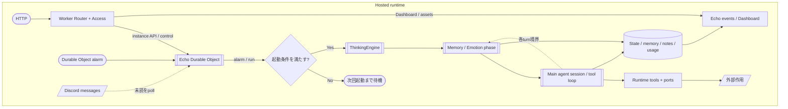
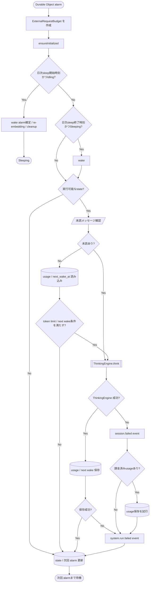
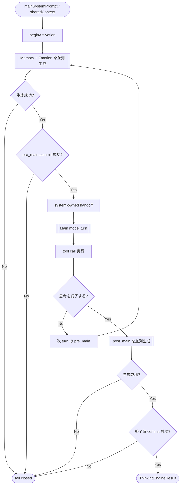
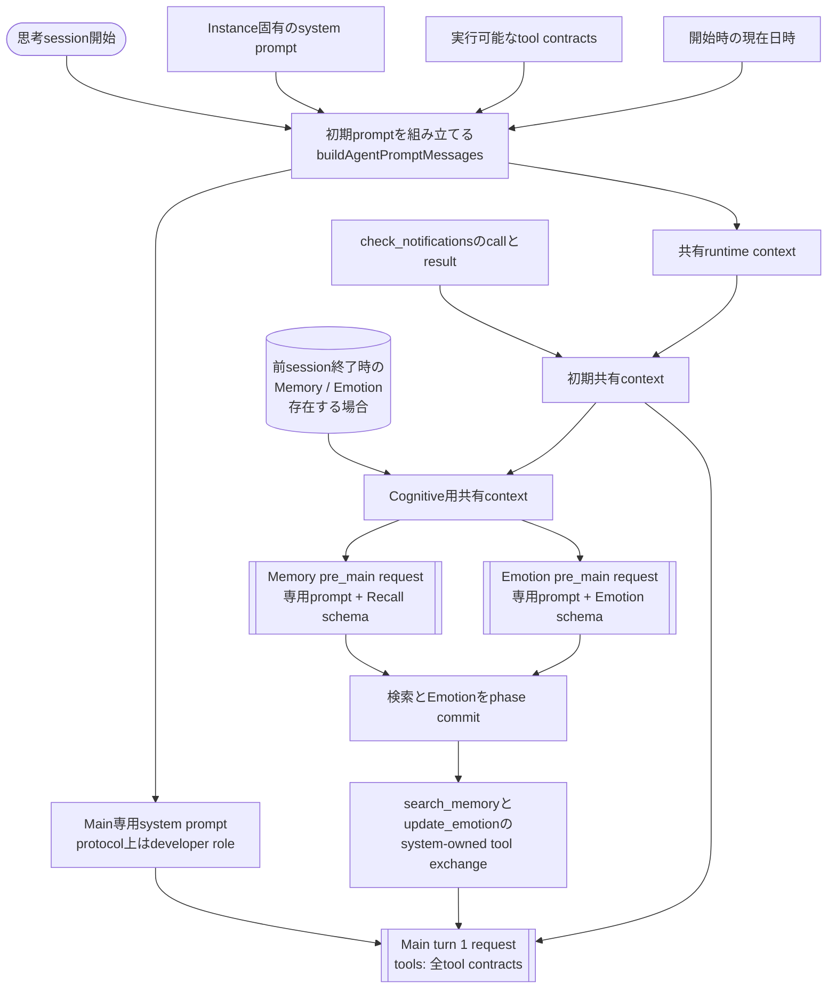
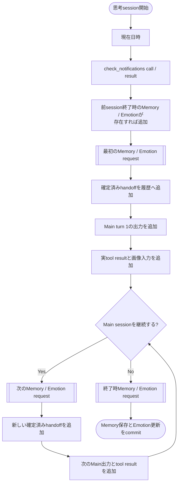
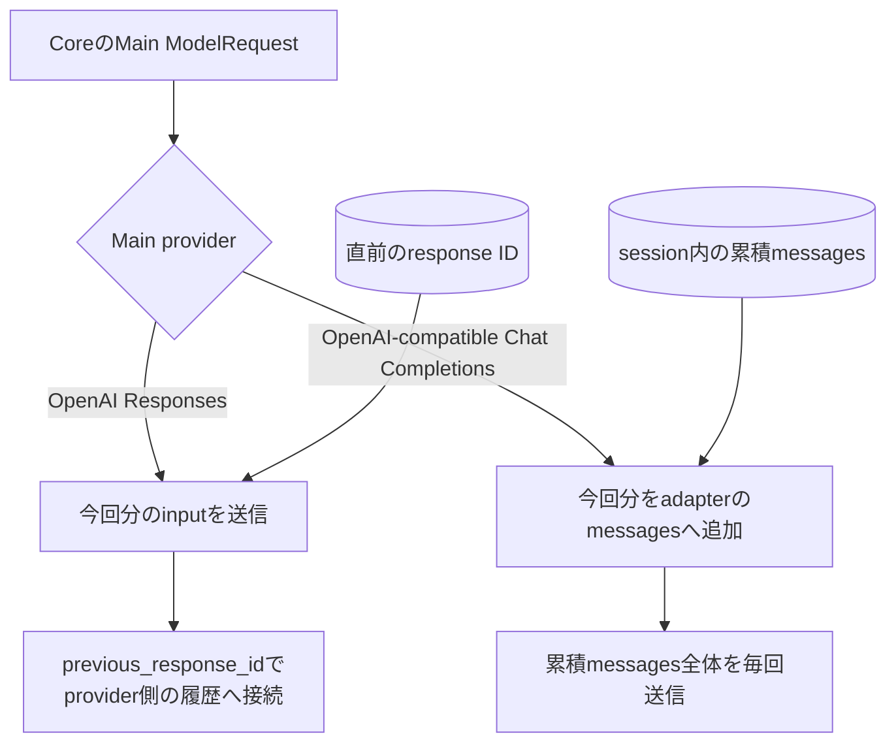
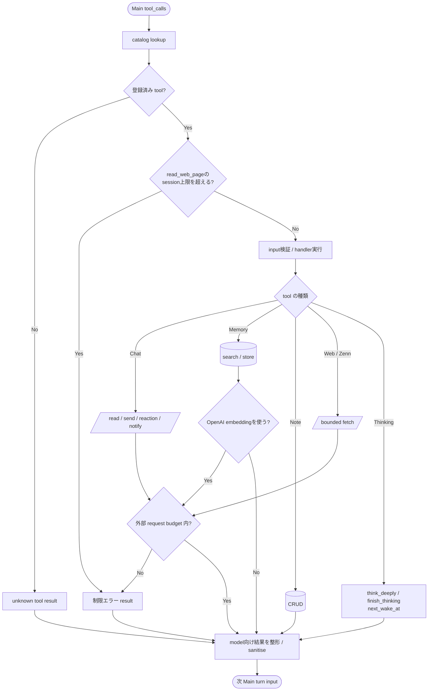
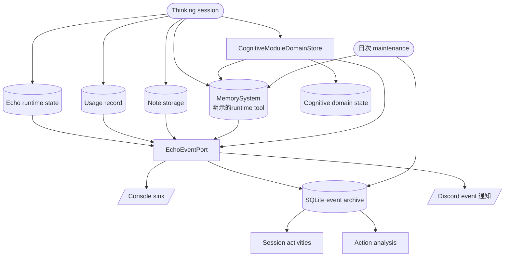
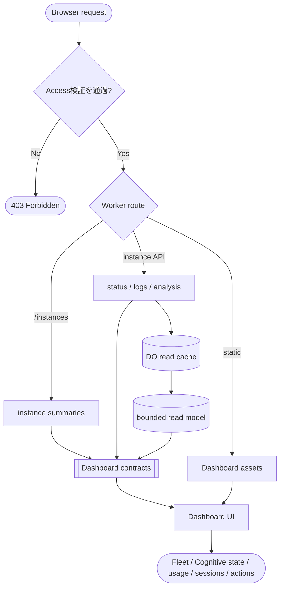

# E.C.H.O. Hosted 処理フロー

この文書は、Hosted runtime が入力を受け取り、Main、Memory Module、Emotion Module、runtime tool、永続化、Dashboard へ処理をつなぐ流れを示します。

図形は一般的なフローチャート記法に統一しています。

- 角丸: 開始・終了
- 長方形: 処理
- ひし形: 判定
- 円柱: 永続化
- 二重枠: サブプロセスまたはモデル実行
- 破線矢印: 補助・参照・反復経路

## 全体像

主な実装: `apps/cloudflare-workers/src/echo/index.tsx`、`packages/core/src/agent/thinking-engine.ts`、`packages/core/src/agent/session.ts`

## 起動・スケジュール

主な実装: `apps/cloudflare-workers/src/echo/index.tsx`

## 思考セッション

主な実装: `packages/core/src/agent/thinking-engine.ts`、`packages/core/src/agent/cognitive-module-orchestrator.ts`、`packages/core/src/agent/session.ts`

## LLMリクエストとコンテキスト

現行Hosted runtimeで通常の思考セッション中に呼び出すLLMは、Main、Memory Module、Emotion Moduleの3系統です。リンとマリーはMainのsystem promptとmodel設定が異なりますが、コンテキストの組み立て方は共通です。

Embeddingとrerankは会話履歴を持つLLM requestではなく、Memory処理の中でtextや候補を個別に渡します。

### 最初のMain turnまで

Mainへは前session終了時のMemoryとEmotionを直接渡しません。保持されている場合はMemory ModuleとEmotion Moduleがそれらを初期状態として読み、最初の`pre_main`で新たに検索・更新した結果だけをsystem-owned tool exchangeとしてMainへ渡します。初期状態のMemoryは、前の`post_main`でMemory Moduleが生成して保存した1件です。

### 各LLM requestの内容

| Request             | `input`の構成                                                                                        | 会話の継続方法                                                          | `tools`                   | 出力契約                                           |
| ------------------- | ---------------------------------------------------------------------------------------------------- | ----------------------------------------------------------------------- | ------------------------- | -------------------------------------------------- |
| Main turn 1         | Main専用prompt → 現在日時 → startup `check_notifications` call/result → 最初のCognitive handoff      | 初回なので過去のprovider応答なし                                        | 実行可能な全tool contract | 自然言語、tool call                                |
| Main turn 2以降     | 直前turnのtool result、必要ならDiscord画像、そのturn用のCognitive handoff                            | Responses APIまたはChat Completions adapterが前turnまでのMain履歴を接続 | 実行可能な全tool contract | 自然言語、tool call                                |
| Memory `pre_main`   | Recall専用prompt → その時点のCognitive共有context全体。初回は前session終了時のMemory / Emotionを含む | 毎回、共有contextの完全なsnapshotを新規requestとして渡す                | なし                      | `{ query }`のstrict JSON Schema                    |
| Emotion `pre_main`  | Emotion専用prompt → Memoryと同一のCognitive共有context snapshot                                      | 毎回、共有contextの完全なsnapshotを新規requestとして渡す                | なし                      | `{ valence, arousal, labels }`のstrict JSON Schema |
| Memory `post_main`  | Store専用prompt → 終了turnまでを含むCognitive共有context全体                                         | 独立した新規request                                                     | なし                      | `{ content, type }`のstrict JSON Schema            |
| Emotion `post_main` | Emotion専用prompt → Memoryと同一の終了時snapshot                                                     | 独立した新規request                                                     | なし                      | `{ valence, arousal, labels }`のstrict JSON Schema |

MemoryとEmotionは同じphaseで同一のimmutable snapshotを読みます。一方のmodel出力をもう一方へ渡すことはなく、両方の検証成功後にruntimeが結果をまとめてcommitします。

### Cognitive共有contextの増え方

Cognitive共有contextに入るもの:

- 思考session開始時の現在日時
- startup `check_notifications`の擬似tool callとsanitise済みresult
- 前sessionの`post_main`で確定したMemory 1件とEmotion。保持されている場合だけ追加し、Cognitive Moduleだけが読む
- それ以前の`pre_main`で確定し、Mainへ渡したsystem-owned tool exchange
- 各Main turnのassistant出力、tool call、sanitise済みtool result
- `read_chat_messages`が返した画像のうち、上限内でvision inputへ変換したもの

Cognitive共有contextに入らないもの:

- Main固有のidentity / persona system prompt
- Main用tool catalog
- Memory / Emotionそれぞれの専用prompt
- Memory / Emotionの生のmodel出力。validationとdomain commit後のhandoffだけを残す

### Main履歴のprovider別接続

- OpenAI Responses APIでは、turn 1だけがMain初期input全体を持ちます。turn 2以降は今回分の増分と`previous_response_id`を送り、provider側に保存された直前までの履歴へ接続します。
- OpenAI-compatible Chat Completionsでは、adapterが同じ思考session中のinputとassistant応答を`messages`へ累積し、毎turnその全体を送ります。互換chat templateを優先するため、coreの`developer` messageは`user` roleへ変換されます。
- `echo-session-cache-v1`はChat Completions requestへcache slot情報を加えるruntime最適化であり、上記のコンテキスト内容を選別する仕組みではありません。
- Memory / Emotionは現状OpenAI Responses API固定ですが、`previous_response_id`では接続しません。各phaseで専用promptとCognitive共有context全体を改めて送ります。

主な実装: `packages/core/src/agent/prompt-builder.ts`、`packages/core/src/agent/thinking-engine.ts`、`packages/core/src/agent/cognitive-module-orchestrator.ts`、`packages/core/src/agent/model-cognitive-module.ts`、`packages/core/src/agent/session.ts`、`apps/cloudflare-workers/src/echo/cognitive-modules.ts`、`packages/openai-adapter/src/`

## Tool・外部作用

主な実装: `packages/core/src/agent/session.ts`、`packages/core/src/agent/runtime-tools/`

## 永続化・ログ

主な実装: `packages/cloudflare-runtime/src/memory-system.ts`、`apps/cloudflare-workers/src/utils/echo-event.ts`

## HTTP・Dashboard

主な実装: `apps/cloudflare-workers/src/index.ts`、`packages/contracts/src/dashboard/`、`apps/dashboard/src/App.tsx`
